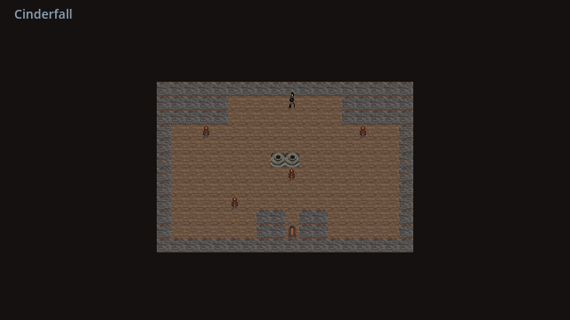
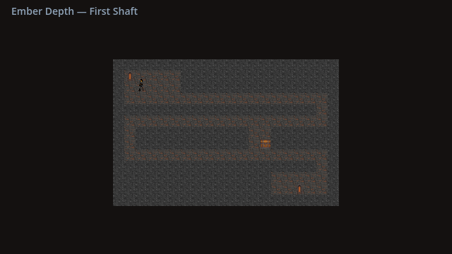
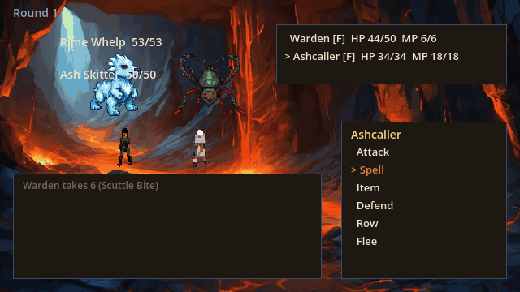
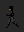
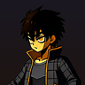
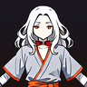
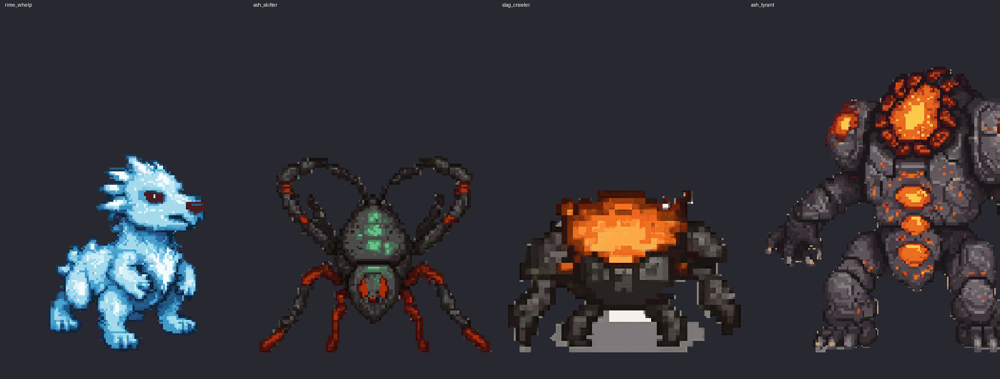
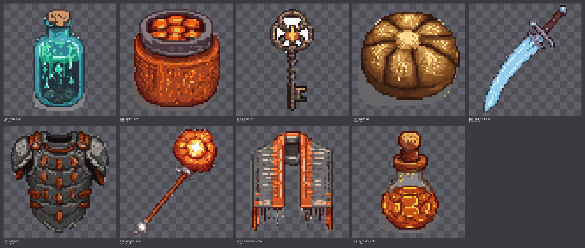
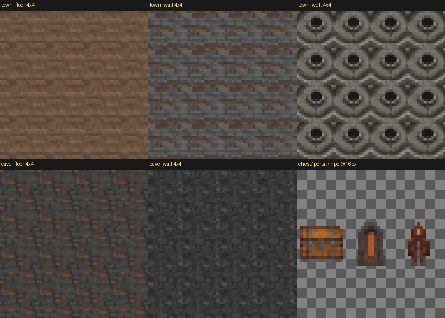
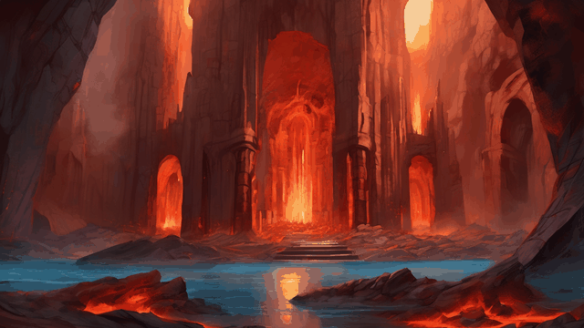

# Emberwake — a MODE 8 showcase

*A village on the caldera's lip sends two hopefuls into the smoldering deep to still the mountain's heart.*

Emberwake is the studio's proving-ground game. Its **Game Design Document is the only hand-authored artifact** — a fixed micro-GDD (one town, a three-floor dungeon, two heroes, four monsters, an ending). Everything below — engine, content, art, music — was produced by the MODE 8 studio (a Claude Code session following the skill library), gated by automated verification, and pinned for exact regeneration. No human drew a pixel or wrote a note of music.

Two heroes descend the Ember Depth to still the waking mountain: **the Warden** (a stoic shaft-warden) and **the Ashcaller** (a frontier caster who burns and mends).

---

## The game, running

The two screens that define a JRPG — the walkable world and the battle — both render entirely generated art. Every screenshot is captured headless from the real engine; the game plays start-to-credits.

**Cinderfall** — the last village on the caldera's lip:

**The Ember Depth** — first shaft, basalt and ember-fissure glow:

**Battle** — pixel sprites over a painterly molten backdrop (the HD-2D look):

---

## The art (all generated, all gate-verified, all manifest-pinned)

**Party** — the Warden and Ashcaller, each a full VNCCS identity → clothing → 4-direction walk-cycle chain. Deliberately contrasting palettes so both read at 24px (the Warden vanishes into dark tiles; the Ashcaller pops):

&nbsp;&nbsp;

**Bestiary** — the non-humanoid pipeline (SDXL + pixel-art, text-prompted, no pose scaffold). The Rime Whelp, Ash Skitter, Slag Crawler, and the Ash Tyrant boss (rendered larger and heavier):

**Item & equipment icons** — the proven SDXL + pixel-art-xl path, each downscaled and palette-quantized deterministically:

**Tileset** — five seamless terrain tiles (seamlessness solved in a deterministic post-blend, not by the model) plus entity markers:

**Battle backgrounds** — painterly HD-2D backdrops (SDXL, no pixel LoRA, so they recede behind the sprites). The Ash Tyrant's molten vault:

**Soundtrack** — seven tracks (town, dungeon, vault, battle, boss, title, victory) generated by ACE-Step from the style bible's mood scaffolds, gate-checked for levels, clipping, and spectral profile. `assets/audio/*.mp3`.

---

## Why this is more than a tech demo

Every asset above is **regenerable from its spec alone**. Each entry in [`assets/manifest.json`](assets/manifest.json) pins the workflow (with its content hash), the exact model revisions, the seed, the prompt override, and the deterministic post-chain — so a fresh session can rebuild any asset bit-for-bit. The verification never sleeps: the balance simulator caught a boss that wiped parties 23% of the time; the rusher persona found a gold-dupe engine bug; every art asset passed a tiered gate cascade before it shipped, and the game's own playtest trace stays **byte-identical** after every single visual change — proving the art layer never touches the logic.

The design conversation is the source code. Everything else is build output.

*Built by the studio, not by hands.*
